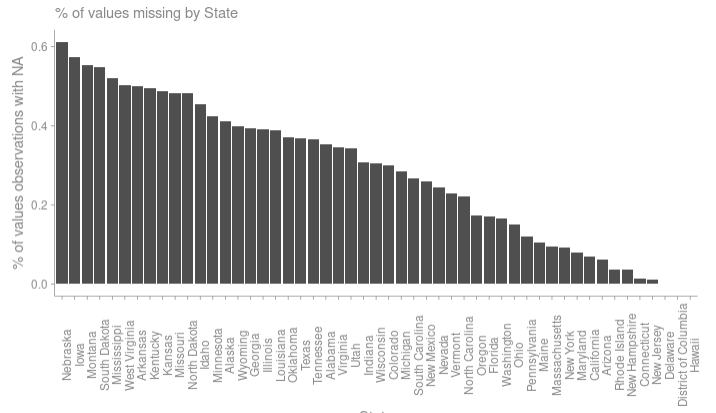
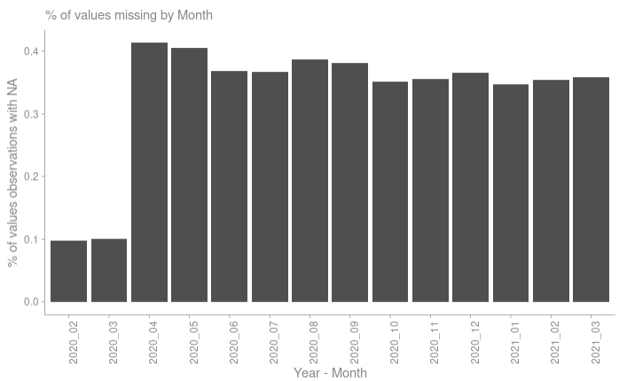
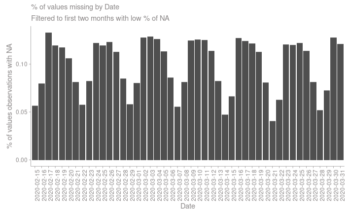
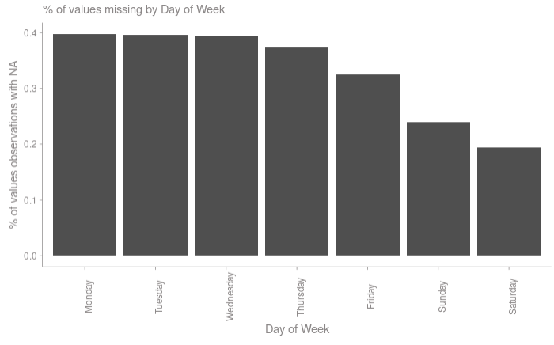

```{r load packages, echo = FALSE, warning = FALSE, message = FALSE}
knitr::opts_chunk$set(echo = TRUE)
library(dplyr)
library(tidyverse)
library(patchwork)
library(stargazer)
library(sandwich)
setwd('.')
```

```{r set graphing theme, echo = FALSE, warning = FALSE, message = FALSE}
minimal_theme_RBGS <- theme(
      axis.text = element_text(color="#959292", size = 9),
      axis.line = element_line(color = "#959292", size = .25), 
      axis.title = element_text(color="#959292", size = 9),
      axis.ticks = element_line(color = "#959292", size = .25),
      panel.grid.major = element_blank(), 
      panel.grid.minor = element_blank(), 
      panel.background = element_blank(), 
      plot.title = element_text(color="#959292", size = 11),
      plot.subtitle = element_text(color="#959292"),
      legend.text = element_text(color="#959292"), 
      legend.title = element_blank(), 
      # legend.justification=c(0,1), 
      # legend.position=c(0,1), 
      legend.direction = 'vertical')
```

```{r load data, echo = FALSE, warning = FALSE, message = FALSE}
data_filtered <- read.csv('../data/processed/processed_data.csv')
```

```{r construct models, echo = FALSE, warning = FALSE, message = FALSE}
# Construct Base Model
model_one <- data_filtered %>%
  lm(avg_retail_rec_change ~ at_home_order, .)

# Construct Primary Model
model_two <- data_filtered %>%
  lm(avg_retail_rec_change ~ 
       at_home_order +                          # Primary variable of interest
       quarantine_length + mask_order +         # Other covid policies/happenings that may confound
       population_density + new_cases_per_100k, # State level effects that may confound
     .) 

# Construct Over-specified Model
model_three <- data_filtered %>%
  lm(avg_retail_rec_change ~ 
       at_home_order +                           # Primary variable of interest
       quarantine_length + mask_order +          # Other covid policies/happenings that may confound
       population_density + new_cases_per_100k + # State level effects that may confound
       new_cases + population +                  # Likely collinear variables
       avg_parks_change,                         # mobility related control we decided against
     .)

# Variance-covariance matrix for each model
beta_cov1 <- vcovHC.default(model_one, type = "HC3")
beta_cov2 <- vcovHC.default(model_two, type = "HC3")
beta_cov3 <- vcovHC.default(model_three, type = "HC3")

# Extract robust se from vcov matrix diagonal
robust_se1 <- sqrt(diag(beta_cov1))
robust_se2 <- sqrt(diag(beta_cov2))
robust_se3 <- sqrt(diag(beta_cov3))

# Add predictions and residuals for model two to dataset
data_filtered <- data_filtered %>%
  mutate(
    predictions = predict(model_two), 
    residuals = resid(model_two)
  )
```

```{r mobility histograms, echo = FALSE, warning = FALSE, message = FALSE}

retail_rec_hist <- data_filtered %>%
  ggplot() +
  # theme(plot.title = element_text(hjust = 0.5)) +
  aes(x = avg_retail_rec_change) +
  geom_histogram(bins=30) +
  labs(title = 'Distribution of Retail and Recreation Mobility Change') +
  xlab('Percent Change in Retail/Rec Mobility') +
  ylab('Count') + 
  scale_x_continuous(breaks = seq(-100, 50, by = 10)) +
  minimal_theme_RBGS

park_hist <- data_filtered %>%
  ggplot() +
  # theme(plot.title = element_text(hjust = 0.5)) +
  aes(x = avg_parks_change) +
  geom_histogram(bins=30) +
  labs(title = 'Distribution of Park Mobility Change') +
  xlab('Percent Change in Park Mobility') +
  ylab('Count') + 
  scale_x_continuous(breaks = seq(-100, 400, by = 50)) +
  minimal_theme_RBGS
```

```{r new cases histogram, echo = FALSE, warning = FALSE, message = FALSE}

new_cases_hist <- data_filtered %>%
  ggplot() +
  # theme(plot.title = element_text(hjust = 0.5)) +
  aes(x = new_cases_per_100k) +
  geom_histogram(bins=50) +
  coord_cartesian(xlim = c(0, 250)) +
  labs(title = 'Distribution of New COVID-19 Cases Per 100K') +
  xlab('New COVID-19 Cases') +
  ylab('Count') + 
  scale_x_continuous(breaks = seq(0, 200, by = 20)) +
  minimal_theme_RBGS

log_new_cases_hist <- data_filtered %>%
  ggplot() +
  # theme(plot.title = element_text(hjust = 0.5)) +
  aes(x = log(new_cases_per_100k)) +
  geom_histogram(bins=30) +
  labs(title = 'Log Distribution of New COVID-19 Cases Per 100K') +
  xlab('Log(New COVID-19 Cases)') +
  ylab('Count') +
  scale_x_continuous(breaks = seq(-6, 6, by = 1)) +
  minimal_theme_RBGS
```

```{r quarantine length histograms, echo = FALSE, warning = FALSE, message = FALSE}

quarantine_length_hist <- data_filtered %>%
  ggplot() +
  # theme(plot.title = element_text(hjust = 0.5)) +
  aes(x = quarantine_length) +
  geom_histogram(bins=30) +
  coord_cartesian(xlim = c(0, 80)) +
  labs(title = 'Distribution of Quarantine Length') +
  xlab('Quarantine Length (Number of Days)') +
  ylab('Count') + 
  scale_x_continuous(breaks = seq(0, 75, by = 10)) +
  minimal_theme_RBGS

log_quarantine_length_hist <- data_filtered %>%
  ggplot() +
  # theme(plot.title = element_text(hjust = 0.5)) +
  aes(x = log(quarantine_length)) +
  geom_histogram(bins=30) +
  labs(title = 'Log Distribution of Quarantine Length') +
  xlab('Log(Quarantine Length)') +
  ylab('Count') + 
  scale_x_continuous(breaks = seq(0, 6, by = 1)) +
  minimal_theme_RBGS
```

```{r normality plots, echo = FALSE, warning = FALSE, message = FALSE}
resid_hist <- data_filtered %>%
  ggplot() +
  # theme(plot.title = element_text(hjust = 0.5)) +
  aes(x = residuals) +
  geom_histogram(bins=30) +
  labs(title = 'Histogram of Residuals') +
  xlab('Residual') +
  ylab('Count') + 
  scale_x_continuous(breaks = seq(-100, 50, by = 20)) +
  minimal_theme_RBGS

qq <- data_filtered %>%
  ggplot(aes(sample = residuals)) +
  stat_qq() + 
  stat_qq_line() +
  labs(title = 'Normal Q-Q Plot') +
  xlab('Theoretical Quantiles') +
  ylab('Sample Quantiles') + 
  minimal_theme_RBGS
```

```{r prediction v residuals plot, echo = FALSE, warning = FALSE, message = FALSE}
pred_v_resid <- data_filtered %>%
  ggplot(aes(predictions, residuals)) + 
  geom_point() + 
  minimal_theme_RBGS +
  geom_hline(yintercept = 0, color = "red") +
  stat_smooth() + labs(title = "Predictions v. Residuals - Model Two")

## Plot Each Variable
q_length_resids <- data_filtered %>% 
  ggplot(aes(quarantine_length, residuals)) + 
  geom_point() + 
  stat_smooth()

pop_density_resids <- data_filtered %>% 
  ggplot(aes(population_density, residuals)) + 
  geom_point() + 
  stat_smooth()

cases_resids <- data_filtered %>% 
  ggplot(aes(new_cases_per_100k, residuals)) + 
  geom_point() + 
  stat_smooth()

at_home_resids <- data_filtered %>% 
  ggplot(aes(at_home_order, residuals)) + 
  geom_point() + 
  stat_smooth()

mask_resids <- data_filtered %>% 
  ggplot(aes(mask_order, residuals)) + 
  geom_point() + 
  stat_smooth()
```

```{r CLM4, echo = FALSE, warning = FALSE, message = FALSE}
# Scale-location
# sc_loc <- plot(model_two, which=3)

# Zoomed scale-location
## Get standardized residuals
r <- rstandard(model_two) 

dropped_obs <- data_filtered %>% 
  filter(
    abs(r) < 0.5
  )

model_two_drop <- dropped_obs %>%
  lm(avg_retail_rec_change ~ 
       at_home_order +                      
       quarantine_length + mask_order + 
       population_density + new_cases_per_100k, 
     .)

# sc_loc2 <- plot(model_two_drop, which=3)

```

```{r COVID EDA, echo = FALSE, warning = FALSE, message = FALSE}
# Load data
nyt_covid_data <- data.table::fread("https://raw.githubusercontent.com/nytimes/covid-19-data/master/us-states.csv")

# Filter Data
nyt_covid <- nyt_covid_data %>% 
  mutate(
    date = as.Date(date)
  ) %>% 
  select(
    date
    ,state
    ,cases
    ,deaths
  )

# Plot 1
ny_state_covid <- nyt_covid %>%
  group_by(
    state
    ) %>%
  filter(
    state == 'New York' | state == 'California' | state == 'Texas'
  ) %>%
  ggplot() +
  aes(x = date, y = cases, color=state) +
  geom_col() +
  theme(axis.text.x = element_text(angle = 90)) +
  labs(x = "Date",
       y = " Cumulative Count of Cases",
       title = "Cumulative Cases for Any Given Day in New York State") +
  scale_y_continuous(labels = scales::comma)


# Plot 2
nyt_covid_new <- nyt_covid %>%
  group_by(
    state
    ) %>%
  mutate(
    new_cases = cases - lag(cases, default = first(cases), order_by = date)
    ,new_deaths = deaths - lag(deaths, default = first(deaths), order_by = date)
  )

ny_state_covid_new <- nyt_covid_new %>%
  group_by(
    state
    ) %>%
  filter(
    state == 'New York' | state == 'California' | state == 'Texas' | state == 'District of Columbia'
  ) %>%
  ggplot() +
  aes(x = date, y = new_cases, color=state) +
  geom_col() +
  theme(axis.text.x = element_text(angle = 90)) +
  labs(x = "Date",
       y = " Number of New Cases",
       title = "Number of New Cases per Day in New York State") +
  scale_y_continuous(labels = scales::comma)
```


\newpage

# Introduction
With minimal federal restrictions in place to control the spread of COVID-19, a majority of state policymakers adopted stay-at-home policies during the early months of the pandemic in order to control the spread of the virus. These stay-at-home orders ranged from one to ten months, with the intent of limiting mobility to only essential activities. We had the unique opportunity to measure the efficacy of these policies across the United States, over the period of February 2020 to March of 2021. 

In particular, our study focused on whether stay-at-home orders are effective in reducing non-essential travel, measured by changes in retail and recreational activities. We gathered data at a daily level for each state in the US. In order to observe non-essential travel, we focused on daily percent changes in mobility patterns to any retail and recreational locations, compared to mobility patterns on those respective days in January-February 2020. 

Finally, based on the date and the state within the US, we indicated whether a stay-at-home order was in place or not for each day. While we believe stay-at-home orders are the primary effect in reducing non-essential mobility, we recognize that stay-at-home orders are not the sole cause of changes in non-essential travel. Therefore, we also utilized other data such as new COVID cases for a given day, whether a mask order was in effect for that day, duration of the stay-at-home order, and population density. 

Both national and state policymakers are facing difficult challenges in reducing further risks of COVID-19 spread, such as the decision to impose stay-at-home orders. In some states, legislators face backlash for not imposing stringent restrictions, while others are criticized for shutting down the economy for too long. Governors in rural states such as Arkansas, Nebraska, Iowa, North and South Dakota have restrained from imposing stay-at-home orders. Other states drew political ire and heightened economic concerns due to prolonged stay-at-home order duration. We believe this research will quantify the effectiveness of stay-at-home orders and public response  to these laws. Moreover, we hope policymakers can better evaluate how well future restrictions may work and whether citizens would behave similarly with such restrictions.

# Model Building Process
## Initial Data Loading and Cleaning
Our final dataset was a combination of three sources of data, including Mobility data (Google LLC 2021), COVID-19 US State Policy Data (Raifman et. al 2020), and COVID-19 Case data (New York Times 2021). 

### Mobility Data - Interim
The Google Mobility dataset was used to extract percent changes in mobility, compared to a five week baseline prior to the spread of virus across the United States. These data aid in uncovering differences in behavior as a result of the pandemic. We utilized changes in retail and recreation mobility as a proxy to quantify the changes in non-essential travels. Other variables, such as changes in park or grocery store mobility were omitted as they represented trends in essential travel. The raw data were collected at a county level with daily granularity, from February 15, 2020 to March 14, 2021. County-level observations were aggregated to the state level, by averaging mobility across counties, retaining daily granularity. 

Documentation provided by Google does not specifically outline missing data, but does discuss the removal of data based on privacy guidelines, which is assumed to be the cause of missing observations. In the one-million-observation-dataset, roughly 300,000 county-level retail and recreation observations contained missing data. These missing observations were characterized in detail, and systematic data-removal patterns were identified (Appendix B). Due to the non-random pattern in missing data, we determined that interpolating or replacing missing observations with zeros would cause misinterpretation of daily trends. The removal of missing observations brings risk to statistical inference. Further discussion on missing data can be found in Appendix B. 

### CUSP Data - Interim
The COVID-19 US State Policy Database (CUSP) tracks dates related to implementation of social safety net, economic, and physical distancing policies in response to the COVID-19 pandemic, as well as state characteristics. For the analysis, the final dataset is built using the Face Masks dataset, Stay at Home dataset, and the State Characteristics dataset at a state level. 

The Face Masks dataset outlines the public face mandate timelines and the date it was in-effect from. Additionally, the End face mask mandate states the date for the mandate expiration at the state level. There was no missing information or outliers detected in this dataset. We noticed that 10 out of the 51 states had a public mandate for face masks. Furthermore, 16 states had no legal enforcement for the facemask mandate, and 36 out of the 51 states still have an existing face mask mandate in place. 
The stay-at-home dataset outlines dates when stay-at-home orders came into effect for each state. It also has a column indicating if a state issued stay-at-home orders but did not specifically restrict movement of the general public. 5 out of the 51 states had stay-at-home orders in effect but failed to restrict movement of the general public. The dataset also provides the dates when the orders expired. There were no missing observations or anomalies noted as a part of the dataset.

The State Characteristics dataset outlines state-specific characteristics such as population density, population in 2018, square miles, homelessness, percentage unemployed etc. For the purpose of this analysis, the columns used were population density, population and the square miles. Since COVID-19 is highly infectious, population density was a variable of interest. The state population was used to normalize new case count for COVID-19.  There were no missing observations or anomalies noted as a part of the dataset.
In summary, the CUSP dataset provides integral information for the model as it has the timelines for the stay-at-home order policy per state as well as the face masks mandate. This information is used to construct the duration of quarantine period per state level and whether a face mask mandate was in effect. Stay-at-home is the primary independent variable used in this study.

### COVID-19 Case Data - Interim
The New York Times COVID-19 dataset was used to obtain the number of coronavirus records in the United States at the state level over time. This time series data allowed us to have a fuller picture of the ongoing outbreak. The data began with the first reported coronavirus case in Washington state on January 21, 2020 and was updated on a daily basis with the final count tallied at the end of each day per state. There are a total of 55 states including four additional US territories (Guam, Northern Mariana Islands, Virgins Islands and Puerto Rico) which will be dropped when merged with CUSP’s state dataset (note that Washington D.C. will be included in the final dataset even though it is not considered a U.S. state). 

Each row of data reports the cumulative number of coronavirus cases and deaths. The counts include both laboratory confirmed and probable cases using criteria that were developed by the state and federal government (CSTE 2020). During the initial stages of the pandemic, “confirmed” cases were characterized as testing positive for SARS-CoV-2 RNA as outlined by the CDC and this was the definition applied. 

Beginning April 5, 2020, “probable” cases were included in the dataset and are defined as a combination of clinical, epidemiologic or serological evidence for the virus without the need for a positive RNA test. In spite of the changes in definition of a case, NYT has revised past data to include both “confirmed” and “probable” cases. Therefore, in some states, the data is revised to show a higher number of cases on past dates.

There were 122 instances of negative values in cases or deaths. These data points were not removed and assumed to be corrective adjustments performed on prior erroneous data entries. We believe omission of the data points would result in an unreliable model regression analysis.

\newpage

### Final Dataset - Processed
Following cleaning of each dataset, the Mobility and COVID time series data were merged by state and date, and then augmented with the state-level variables of interest from the State Policy Database. For further analyses, we created a number of new variables:

- `at_home_order`: indicator variable - 1 if state is under stay-at-home order at date ‘t’, 0 otherwise
- `mask_order`: indicator variable - 1 if state is under mask mandate at date ‘t’, 0 otherwise
- `new_cases`: the number of new cases, by state, since date ‘t-1’
- `new_cases_per_100k`: standardization of new_cases variable, normalized by 2018 state population and multiplied by 100,000 for easier interpretation 
- `quarantine_length`: numeric variable - number of days a state has been in quarantine at date ‘t’. Resets to 0 when stay-at-home order ends. 

In addition to the created variables above, the final processed dataset contained the following variables for our models:

- `avg_retail_rec_change`: outcome variable, percent change in retail and recreation mobility compared to baseline
- `population_density`: number of residents per square mile, by state
- `population`: number of individuals residents, by state
- `avg_parks_change`: percent change in parks mobility compared to baseline

Further discussion of variable transformation will be addressed in the “Variable Exploration and Transformation” section.

## Variable Exploration & Transformation
### Mobility Variables
Our model aims to isolate the effect of stay-at-home orders on non-essential mobility, which is operationalized by the change in retail and recreation mobility. A number of similar mobility-change measures were available in the Google Mobility dataset, such as change in grocery and pharmacy, and public transportation. Each of the variables, outside of change in retail and recreation, were identified as likely essential travel, and are therefore outside the scope of our research. Change in mobility to parks is identified as a possible control variable for our over-specified model. 

Retail and recreation mobility data were distributed with a negative skew, with continuous representation of the range of values. Due to the well-distributed dispersion of both mobility measures (Figure \@ref(fig:mobHist)), no variable transformations were applied. Additionally, the percent change metric of our outcome variable provides intuitive interpretation of model coefficients, in which each coefficient will relate its effect to a percent change in non-essential mobility. 

```{r mobHist, echo = FALSE, message = FALSE, warning = FALSE, fig.width=12, fig.height=4, fig.cap = 'Histograms of Retail/Recreation and Parks Mobility Changes'}
retail_rec_hist | park_hist 
```

### CUSP Variables
The CUSP dataset mainly consisted of two types of variables. The first was binary variables used to indicate if a policy was in effect such as face mask mandate or stay-at-home policy. The second type of variable in the dataset was of type dates showing the start/end date of various policies . For this study, the columns used had date type values.

Some datasets had zero as the date value which mapped to the policy never being introduced in the state. None of the rows were dropped and the zero-valued dates were mapped as NA. This helped identify states which did not have a stay-at-home order or face mask mandate. 

Dates in the CUSP dataset were not explicitly included in the processed data. Rather, they were used to create new variables as mentioned in section 2.2.4, Processed Variables. Therefore, no transformations were required as a part of pre-processing. Each column with date type was ensured to have datetime in the correct format in the pre-processing step. Overall, the data was well-structured and defined.

### COVID-19 Variables
Based on our initial plotting of three states (NY, CA and TX), we obtained cumulative cases for any given day in each state (Appendix C). In order to obtain the number of new cases per day, the number of total cases was subtracted from the prior row (day before). Case and death counts were further normalized by state population.

State-normalized new cases distribution is highly skewed towards the right (Figure \@ref(fig:covidHist)). After applying a log transformation, the distribution appeared to be relatively bell-shaped as displayed in Figure \@ref(fig:covidHist). However, this transformation came at the cost of approximately 16,000 data points being omitted. We believe that the zero cases are integral in our subsequent model regression analyses and will proceed to keep these data points. 

We have considered adding a “0.01” to zero cases to mitigate omission from applying the log transformation but ultimately decided against doing so as a 0.01 case does not make sense. An individual is either infected with COVID-19 or is not. There is no in-between state. Thus, no transformations will be performed on this variable.

```{r covidHist, echo = FALSE, message = FALSE, warning = FALSE, fig.width=12, fig.height=4, fig.cap = 'Histograms of New COVID-19 cases per 100k with and without transforms'}
new_cases_hist | log_new_cases_hist
```

### Processed Variables
None of the new indicator variables were candidates for variable transformation due to their categorical nature. Variable transformation was considered for the quarantine length variable, however. Quarantine length had heavy clustering around zero as many observations were captured outside of a quarantine period, or were relatively low for many states with short stay-at-home orders (Figure \@ref(fig:qHist)). 

```{r qHist, echo = FALSE, message = FALSE, warning = FALSE, fig.width=12, fig.height=4, fig.cap = 'Histograms of stay-at-home durations with and without transforms'}
quarantine_length_hist | log_quarantine_length_hist
```

Due to the many zero-valued observations, log transformation was not an option. A square root transformation could provide a better distribution of the data, but would reduce the ease of interpretation of the model coefficient. Ultimately, the quarantine length variable was not transformed in order to retain zero-valued observations, and intuitive interpretation of model coefficient. This feature allowed the research team to isolate the effect of length stay-at-home orders on a population's willingness to decrease non-essential mobility. 

# Regression Models & Table
Due to the limited size of unique observations across our time series of fifty states, we are employing the Classical Linear Model. We included three different models in our approach, each serving a different purpose. The second model is our primary model, and is the basis of research outcomes. The base model provides an under-specified comparison to the second model, exhibiting the change in stay-at-home order model estimate based on inclusion of additional variables. Finally, the third model is an over-specified model, with collinearity in variables that threatens sound interpretation.

## Model Construction
### Base Model
For our base model, we only included the main independent variable, stay-at-home order, which is an indicator variable defined in Section II, Model Building Process. This isolated the effect of the stay-at-home order for a given day on the percentage change in non-essential mobility, compared to the pre-COVID baseline value for that respective day. These variables for the base model are identified in Table 1, column (1). 

This model assumes that only the stay-at-home order had an effect on the change in non-essential mobility and no other variables were taken into account for this particular model. Because there are other variables like COVID cases and state population density that could potentially play a role in the change in non-essential mobility, we expect that while stay-at-home order is our primary independent variable, its effect will most likely be overstated due to the omission of these other controlled variables. We discuss this further in Section 5, Omitted Variables.


### Primary Model
Each of the included features in our primary model were based on the belief that they were confounding effects or were necessary to include in order to properly isolate the causal effect of stay-at-home orders on non-essential mobility. Variables for model two are identified in Table 1, column (2), with theoretical justification for each variable inclusion below.

Quarantine length is used to control against “COVID fatigue”, which describes the pattern of increased mobility as a result of longer lockdowns (Reese & Bollag, 2020). Including this variable isolates the effect of a stay-at-home order versus the duration of that quarantine. 

Additionally, we had a number of theories on how mask mandates may affect both stay-at-home orders and the change in non-essential mobility. We believed mask mandates could potentially be related to increases in mobility, as citizens may feel a false sense of security and resume non-essential activities. Alternatively, we theorized that mask mandates may be responsible for reduced non-essential travel as it could potentially signal a heightened severity in the state of the pandemic and deter mobility due to widespread scare. 

Based on the known relationship between COVID-19 spread and dense populations (Wong & Li, 2020), we also chose to control for state population density. We believed there would also be a relationship between population density and non-essential mobility, as more populated cities such as New York and San Francisco were known for more stringent stay-at-home measures. 

Finally, we included the amount of daily new COVID-19 cases normalized by state population. We believe that citizens may respond to large spikes in state-level daily COVID-19 cases by reducing their mobility. Therefore, we chose to include this variable to control for the effect that may exist between reporting of local COVID-19 trends and its effect on non-essential mobility.

By including each of these control variables, we believe we provide a stronger causal claim in our estimation of stay-at-home order efficacy compared to model one. However, without inclusion of all of the possible confounds, as well as a strong statistical technique, such as difference in difference, we are unable to make a complete causal claim. Further discussion of omitted variables as well as discussion on the decision to *not* employ Difference-in-Differences technique can be found in Study Limitations, section 4. 

### Over-specified Model
For our third and final model, we included variables that potentially add an extra layer of information to the variables from our second model. While we believe our primary model to be sufficient in explaining changes in non-essential mobility, we wish to check if these extra variables would provide some sort of added explanation to the non-essential mobility and also check the model coefficients on variables that we might believe to be highly collinear. Variables for model three are identified in Table 1, column (3). 

We added daily COVID-19 case changes without the normalization by population to see if the quantity of cases, regardless of the inherent population of the state, would have a different or extra effect on changes in non-essential mobility. In addition, we included population as another variable to similarly test if the number of people in a given state provided an additional effect to our dependent variable, on top of the population density.

Finally, we included percent changes in mobility at parks (local parks, national parks, public beaches, plazas, etc) as our last variable. We were interested in whether mobility patterns at these public parks were similar to mobility patterns at retail and recreational locations, or non-essential mobility, and if traveling more to these parks also influenced non-essential mobility. We assumed travel to these parks was deemed essential for mental and physical health purposes and did not exhibit the same level of non-essential activity.

With the exception of mobility at parks, the additional variables may have overlapping relationships to variables in the primary model and likely cause overfitting of  the model. While all three additional variables are not necessary, they could still provide some additional effect on overall non-essential mobility. At the minimum, increased mobility at parks may indicate an overall increase in mobility at retail and recreational locations.
          
```{r, header = FALSE, results = 'asis',  message = FALSE, error = FALSE, echo = FALSE, warning = FALSE}
stargazer(
  model_one, 
  model_two,
  model_three,
  se = list(robust_se1, robust_se2, robust_se3), # replace classical w/ robust SE
  title = 'Regression Results',
  type = 'latex'
  # type = 'text'
)
```

## Model Interpretation
### Base Model
For our primary variable, stay-at-home order, we reject the null hypothesis that there is no relationship between stay-at-home order and non-essential mobility, with a p-value of less than .01 (Table 1 (1)). This means there is a very small probability, given our CLM assumptions are sufficiently satisfied, that we are rejecting the null hypothesis when it is actually true.  The result signifies that there is a roughly 22% decrease in non-essential mobility during periods when stay-at-home orders are in effect. In addition to a very highly statistically significant result, a reduction in non-essential mobility by roughly 22% is practically significant as well because policymakers who believe that the population of the US is accurately representative of their state would expect over a fifth reduction in non-essential travel while a stay-at-home order is in place. 

In periods where a stay-at-home order is not in place, the reduction in non-essential mobility would be only roughly 9% overall, as represented by the model constant. We can most likely associate this with the general lack of movement during COVID-19 due to business and work closures, as well as generally trying to stay safe in one place during the pandemic. 

The risk in relying on this model, however, is that we are making a strong causal claim that stay-at-home orders solely cause changes in non-essential mobility when in reality, new COVID case count or a current mask order also have some impact on whether people are traveling to retail and recreational locations. In fact, our R-squared value is quite low, indicating that the variance in our change in non-essential mobility isn’t explained very well by the stay-at-home order during a given time period. 

### Primary Model
For our primary variable that indicates a stay-at-home order, we reject the null hypothesis that there is no relationship between stay-at-home order and non-essential mobility, with a p-value of less than .01 (Table 1 (2)). Similar to our interpretation of the base model, we are able to rely on this result assuming CLM assumptions are met. Specifically, we are able to present evidence that there is a roughly 28% decrease in non-essential mobility during periods when stay-at-home orders are in effect. In addition to a high level of statistical significance, a reduction in mobility of 28% is also highly practically significant. In practice, policymakers who believe their state is similar enough to the overall population may expect a roughly 30% reduction in non-essential travel as a result of implementing a stay-at-home order.

The addition of our control variables also provides interpretation of their effects on non-essential mobility. Each of the control variables (quarantine length, mask order, population density, and new cases per 100k) have a statistically significant effect, with p-values less than .01. These p-values, however, rely on sufficient fulfillment of each of the CLM requirements, which will be further discussed in the Study Limitations, section 4. 

The length of quarantine is measured in number of days, and its positive coefficient provides evidence to our theoretical hypothesis that extended stay-at-home orders would result in an increase in non-essential mobility. Specifically, our model would suggest that each additional day of quarantine may result in a .08 percent increase in mobility. Practically, this coefficient is roughly zero. For example, the majority of state stay-at-home orders lasted between 30-60 days. Multiplying 30 - 60 days by the coefficient of .08 would suggest a roughly 2-5 percent increase in non-essential travel, holding all else constant. 
 
During periods when mask orders were implemented, policymakers may also expect a small reduction in non-essential mobility.  Our model suggests that there is an estimate of 4% reduction in discretionary travel holding all other inputs constant. 

Similar to length of quarantine, population density per square mile has a relatively small coefficient of .0003. Knowing that all fifty states have a population density per mile of 1,200 or less, this effect is practically insignificant. This estimate is likely adjusted slightly downward to account for population-dense areas like Washington D.C, which has nearly 11,000 residents per square mile. 

The coefficient estimate for the number of new cases per day, per one hundred thousand residents, suggests that for each 100 new cases in a day, a 7% decrease in mobility could be expected. Following our primary variable, this is one of our highest estimates in terms of practical significance, and suggests that daily mobility trends are particularly sensitive to localized trends in COVID-19 confirmed cases. Include analysis about constant?

Finally, the constant estimate of roughly four percent represents the average decrease in non-essential mobility, assuming none of the modeled policies were in effect, and the control variables had values of zero. This is a five percent decrease from the constant estimate in our base model, and is only changing to fit our linear model through the grand mean as we include new variables. 

Overall, our model would suggest that policymakers who wish to reduce non-essential mobility could expect greatest response from implementing stay-at-home orders, and by publishing COVID-19 confirmed case trends in a publicly accessible format. While duration of stay-at-home orders, mask orders, and population density each had a statistically significant and non-zero effect on reducing mobility, the magnitude of their estimates related to observed values are minimal compared to stay-at-home orders and trends in new cases.

### Over-specified Model
Similar to our base and primary models, we reject the null hypothesis that there is no relationship between stay-at-home order and non-essential mobility, with a p-value of less than .01 (Table 1 (3)). Specifically, we can present evidence that there is a roughly 26%  decrease in non-essential mobility during periods when stay-at-home orders are in effect. In addition to a high level of statistical significance, a reduction in mobility of 26%  is also highly practically significant. Similar to our primary model, policymakers who believe their state is similar enough to the overall population may expect a roughly one fourth reduction in non-essential travel as a result of implementing a stay-at-home order.

With regards to the variables that were also in the second model, we still see that quarantine length, mask order, and population density still have a highly statistically significant effect with p-value of less than .01. The coefficients for quarantine length and population density effectively stayed the same as seen table 1, indicating that the addition of variables for our third model had no apparent effect on the effect sizes of these two variables. We do see a slight reduction in the coefficient for mask order, however, from -3.4 to -4 between the second model and third model. The inclusion of percent change in parks visitation pulls some of the effect from our stay-at-home indicator and amplifies the effect of  the mask order. 

By including variables that are outside of our causal framework and are highly collinear, however, we see the coefficients on this over-specified model changing in unpredictable ways in comparison to our primary model.  These variables will likely share relationships between each other, causing the effect of some coefficients to be split. For example, we see that the coefficient estimate for the number of new cases per day per one hundred thousand residents changed from negative to positive and suggest that for each 100 new cases in a day, a 0.9% increase in mobility could be expected, contrary to what we observe in the primary model, where we saw a considerable percent decrease in mobility. Additionally, we see that the coefficient for the total number of new cases is -0.0003 and believe that the effect that our new COVID cases per one hundred thousand residents had on the model was absorbed by the neutral new cases variable. In addition, we notice that the coefficient for the additional population variable is effectively zero (9x10^-8), without exhibiting perfect collinearity. This coefficient could be a normalization factor for the states that have a much higher population, indicating that the denser populations have more movement.

Contrary to the other added features, the inclusion of mobility at parks variable yielded a statistically significant coefficient that was also reasonable. Specifically, for every percent increase in mobility at parks, we get a 0.1% increase in mobility at retail and recreational locations. We can likely attribute this to slightly increased comfort level and confidence in traveling to non-essential locations if we see more people visiting public parks. Also, if people are already traveling to a park, they may be more likely to visit the retail and recreational locations while they are already out. We might also have states, however, that open public parks but restrict people at retail and recreational locations, and that’s why we barely see any increase in mobility to those locations. 

In conclusion, the over-specified model does not add much value to our primary model overall. New COVID cases and population count are already accounted for in the primary model through the new COVID cases per one hundred thousand residents and population density variables. Adding these two extra variables to the third model effectively dilutes some of our model coefficients and returns contradictory information to what we expect. It might be worthwhile, however to include mobility at parks in our model because this might explain some more of the variance in non-essential mobility, but because of different state policies with opening and closures of different locations at different times, we must take this relationship between parks mobility and non-essential mobility lightly. 

# Study Limitations
## Assessment of CLM
### IID
Due to the time-series nature of the data as well as our inability to effectively implement Difference-in-Differences techniques, the independence assumption is systematically flawed. Especially in the case of COVID-19 reaction, citizens are likely changing behavior today based on events from days prior. Another threat to independence may be  spill-over effects in states like New Jersey and New York, where groups commonly cross state lines for work, retail, and a number of other reasons. 

Additionally, each of these states does not come from an identically distributed population. We believe that citizens in California may behave differently than citizens in Texas due to cultural differences. Additionally, since mobility data is only available based on users who opt-in to location tracking, the sampling is non-random and may be biased by groups who choose to opt-out. 

We could further minimize the issue of differing sampling distributions by including more controls such as socioeconomic factors, and state-level political affiliation, in addition to our existing controls of population density and mask orders. The purpose of these additional controls would be to adjust for the non-random sampling of our data. 

### Normally Distributed Errors
The fifth assumption for the classical linear model is for the errors to be normally distributed. The Q-Q plot in Figure \@ref(fig:residHist) shows that the distribution of errors is not symmetric and does not meet this assumption. Looking at the skew on the left tail, the residuals have a long tail which is also observed in the histogram of residuals. The long tail is coming due to the OLS over predicting for the values close to the left tail. 

Since, the assumption is violated, this directly has an impact on the p-values and standard errors. The p-values for the coefficients in the model might be overstated. The effect can be mitigated by transforming variables. However, during the data exploration stage, logarithmic transformations were considered for the new case count variable and it was decided that a value of zero for case count adds value to the model. Adding a constant such as 0.1 to all the 0 case counts can skew the data and yield unexpected results. Finally, we also considered removing outliers in quarantine length (Appendix F) but this resulted in approximately 50% of the data points being dropped. Again, this would yield to the model misrepresenting  the data. Accounting for the above points, we decided to continue our analysis being cognizant of the fact that the errors were not normally distributed.

```{r residHist, echo = FALSE, message = FALSE, warning = FALSE, fig.width=12, fig.height=4, fig.cap = 'Checks for Normality'}
resid_hist | qq
```

### Summary of CLM Violations
While none of the CLM evaluations provided severe enough evidence to completely disallow usage of the classical linear regression model, the imperfect fulfillment of some of the requirements poses a threat to both internal and external validity, which threaten the interpretation of our model. These assumptions ensure our ability to make statistically-grounded inferences about the data, and without fulfillment of these requirements, the estimates for each of our coefficients may be biased, inconsistent, and without accurate p-values. 

Our biggest violation of the classical linear model requirements was CLM #5 - normally distributed errors.  As mentioned above, attempts to transform variables and remove outliers introduced other limitations in our study. Accepting a model that yields non-linear errors results in biased standard errors, increases in type-I error above our .05 threshold, and likely inaccurate p-values. 

In addition to the violations in CLM #5, the first CLM requirement of independent and identically distributed data was also violated. The violation of this requirement leads to bias in our estimates. In response to violation of this assumption, we experimented with difference in differences estimation to reduce the amount of bias presented by imperfect sampling. Further discussion on limitations with difference in differences approach is located in the following sub-section - Other Limitations.

## Other Limitations
### Difference-in-Differences
After the Stay at Home orders were enacted, it is important to estimate the effect it had on non essential mobility. The reason the states across the country enacted orders was to stop the spread of COVID-19. One way to answer this question would be to use the Difference-in-differences(diff-in-diff) statistical model. 

To use the diff-in-diff model, there is a need of observed outcomes of groups who were exposed to the intervention(treated) and groups who were not exposed to the intervention(control), both before and after the intervention. 

Diff-in-diff model was considered for this analysis because there were states which had mandated a Stay at Home order but did not specifically restrict movement of the general public. The control group would consist of Connecticut, Hawaii, Kentucky, Oklahoma, and Texas. The treatment group would consist of the remainder of the states.

We encountered two concerns with the Differences-in-Differences estimation technique that caused us to not use this method. Primarily, we had to pick one start and one end date for stay-at-home orders across the United States. Because states introduced stay-at-home orders with different start-dates and durations, we would be sacrificing richness in the data, and making a weak assumption about a unified treatment time. Additionally, there is concern in the requirement for homogeneity across the different comparison groups. We believe that states like Texas are inherently different than states like California. A further discussion on our Difference-in-Differences modeling, estimation, and concerns is located in Appendix G.  

# Discussion of Omitted Variables

# Conclusion
In conclusion, our model provides evidence that there is a strong negative relationship between stay-at-home orders and non-essential mobility. This result provides policymakers evidence that if they impose restrictions on non-essential movement, they may expect a 28% decrease. 

Each of our control variables exhibited significant negative relationships as well, with the exception of duration of stay-at-home order. The positive nature of this relationship suggests there may be a tipping point, in which “COVID-fatigued” individuals start to increase their non-essential activities after extended periods of lock-down. Mask mandates, number of new COVID-19 cases, and population density exhibited negative relationships with non-essential mobility as well, but were much smaller in magnitude. 

Therefore, we would suggest that policymakers looking to reduce non-essential mobility may receive the highest response by imposing stay-at-home orders of reasonable length, and by publishing publicly-accessible trends in local COVID-19 infections. 

While we believe our model is able to identify trends in the data and represents a causal relationship between our dependent and independent variables,  omitted variables, the inability to operationalize Difference-in-Differences, and violations of the CLM provide risk to our model. 

<!------------------------------------------------------------------------------------------------------------------------------------->

\newpage

# Appendix
## Appendix A: References 

1. CSTE (2020). Standardized surveillance case definition and national notification for 2019 novel coronavirus disease (COVID-19). Retrieved April 8, 2021 from https://int.nyt.com/data/documenthelper/6908-cste-interim-20-id-01-covid-19/85d47e89b637cd643d50/optimized/full.pdf

2. Google LLC. (2021). "Google COVID-19 Community Mobility Reports". Retrieved March 18, 2021. Available at: https://www.google.com/covid19/mobility/

3. The New York Times. (2021). “Coronavirus (Covid-19) Data in the United States.” Retrieved March 24, 2021. Available at: https://github.com/nytimes/covid-19-data.

4. Raifman J, Nocka K, Jones D, Bor J, Lipson S, Jay J, and Chan P. (2020). "COVID-19 US state policy database."  Retrieved March 21, 2021. Available at: www.tinyurl.com/statepolicies

5. Reese, P., & Bollag, S. (2020, December 23). Californians still going out despite stay-at-home orders, tracking data shows. Sacramento Bee. Retrieved April 5, 2021, from https://www.sacbee.com/news/coronavirus/article248036890.html

6. Wong, D. W., & Li, Y. (2020). Spreading of COVID-19: Density matters [Abstract]. PLOS ONE, 15(12). doi:10.1371/journal.pone.0242398

\newpage

## Appendix B: Discussion on missing observations in mobility dataset
During Exploration of the retail and recreation mobility data, patterns were observed in missing observations as noted in Part II, Model Building. 

First, the distribution of missing values was not equal across states, as seen below in Appendix B.1. This poses a particular threat in population inference, especially for states with high percentages of missing observations. 


In further exploration of the data, a skewed distribution of missing data by month was observed, with heavy amounts of omitted data occurring in the first two months of the data. 


                
Isolating on the first two months, it is clear there is a systematic pattern of missing observations by day of week. 


                
Returning to the entire dataset, we identified a pattern in missing data by day-of-week as well - where highest percentages of NA’s occurred during the week. Without the ability to locate further information on missingness, the group was forced to drop these observations. Additionally,  due to the time series nature of the data and the fluid trend, outlier treatment, such as interpolation or replacement with averages, was not administered due to the risk of overshadowing trends real trends in included data.




\newpage

## Appendix C: Discussion on variable transformation in NYT COVID-19 Dataset

```{r COVIDEDA1, echo = FALSE, message = FALSE, warning = FALSE, fig.width=12, fig.height=4, fig.cap = 'prediction versus residuals by variable'}
ny_state_covid | ny_state_covid_new
```

\newpage

## Appendix D: CLM Requirement #2: Linear Conditional Expectation 
In our tests of linear conditional expectation, we have not identified strong enough evidence to suggest this rule is violated to the extent that the classical linear model is no longer usable. In evaluation of this requirement, we focused on identification of a sufficiently linear prediction line when plotting predictions versus residuals, at or around the zero intercept (Appendix D.1). Across predicted  values, the modeled line was very close to zero, with a fairly flat trend for the majority of observations. The right side of the graph does exhibit an uptick in prediction error which is influenced by outliers that are further discussed in Appendix F - CLM 4. 

```{r predResid, echo = FALSE, message = FALSE, warning = FALSE, fig.width=12, fig.height=4, fig.cap = 'Predictions versus Residuals'}
pred_v_resid
```

Additionally, there was no strong trend that could be identified as a lower-order polynomial, log, or square root. In addition to this summary plot, we evaluated linear relationships of each dependent variable against residuals (Appendix D.2). None of single-variable plots exhibited strong nonlinear trends, with the exception of new cases per one hundred thousand. The decision to not transform this variable was documented Part II, model construction.

```{r predResid2, echo = FALSE, message = FALSE, warning = FALSE, fig.width=12, fig.height=6, fig.cap = 'prediction versus residuals by variable'}
(q_length_resids | pop_density_resids) /
  (mask_resids | at_home_resids) /
  (cases_resids | plot_spacer())
```
\newpage

## Appendix E: CLM Requirement #3: No Perfect Collinearity
Because we don’t see any coefficients dropped from our primary model in table 1, we can safely assume no perfect collinearity. Also, all of the coefficients have values that are comprehensible and can easily be interpreted. FInally, we looked at the Variance Inflation Factor (VIF), which measures how much the variance of each regression coefficient is inflated due to multicollinearity in the model. We noticed that the VIF values are very close to 1, indicating that each variable had minimal inflated variance due to potential multicollinearity in the model. 

```{r, echo = FALSE, message = FALSE, warning = FALSE, fig.width=12, fig.height=4, fig.cap = 'prediction versus residuals by variable'}
car::vif(model_two)
```

\newpage

## Appendix F: CLM Requirement #4: Homoskedastic Errors 
In order to assess whether the distribution of the errors is homoskedastic, we will examine the residuals versus fitted plot again (Appendix D.1). We are interested in whether or not there is a band of even thickness form left to right. There appears to be an increase in the variance of residuals on the right-end side as noted in Appendix D, CLM 2. However, it is not severe. 

Another idea is to examine the scale-location plot. Homoskedasticity would show up on the plot as a flat smoothing curve. Based on Appendix F.1, there appears to be an uptick on the variances on the residual points with fitted variables, suggesting a slight problem with heteroskedasticity (non-constant variances in residual errors). This could be attributed to the new cases per 100k variable obtained from the COVID-19 dataset as we assumed negative new case counts were corrective adjustments made to erroneous data entry. In addition, we also observed "data dumps" on a given day in certain states such as Missouri in which 290 new cases in the previous day and the 50,328 new cases in the next day. The “data dumps” are assumed to be the change in cases definition as mentioned in the COVID-19 data interim section.

```{r, echo = FALSE, message = FALSE, warning = FALSE, fig.width=12, fig.height=4, fig.cap = 'prediction versus residuals by variable'}
plot(model_two, which=3)
```

In an attempt to further research on the uptick in scale-location plot, we filtered out residuals above 0.5 for the sake of homoskedasticity at the cost of removing 9,641 outlier data points. Although the uptick has reduced in the scale-location plot (figure below), the trade-off is that close to 10,000 data points were omitted. 

```{r, echo = FALSE, message = FALSE, warning = FALSE, fig.width=12, fig.height=4, fig.cap = 'prediction versus residuals by variable'}
plot(model_two_drop, which=3)
```

As mentioned above, we attribute the outliers to erroneous data entries or “data dumps”. With this in mind, there is no concern of homoskedastic errors as the issue is not severe enough to warrant violation of CLM 4 assumption.

\newpage

## Appendix G: Difference-in-Difference Discussion and Estimation
The next requirement was to understand when the intervention happened. The Stay at Home orders came into effect at different points in time in the year 2020. Some states were proactive and were quick to introduce one in March while others never imposed one. The intervention date was calculated by taking the average of the earliest Stay at Home order and the last Stay at Home order which came into effect. This date was calculated to be March 28th, 2020. One of the primary reasons we did not move forward with Difference-in-Differences 

The 2 diff-in-diff models were run with the below variables.

```
DID <- data_filtered %>%
  lm(avg_retail_rec_change ~ start*group + quarantine_length + mask_order + population_density + new_cases_per_100k, .)

DID2 <- data_filtered %>%
  lm(avg_retail_rec_change ~ start*group + quarantine_length + mask_order + new_cases_per_100k, .)

```

The difference between the two models was the addition of the control variable for population density. The start*group variable’s coefficient is the difference in mobility between the control and treatment group pre intervention and post intervention. The difference was observed to be -2.3% 

The results from the difference-in-differences model showed that non-essential mobility did not change by a lot between the two groups after the intervention. However, a lot of other factors are not accounted for as a part of this analysis.

Diff-in-diff  model works well when both the control and treatment groups are identical but when taking states into account, the states are far from identical. They have different political leanings and philosophies. Due to the polarity in the country, a lot of states did not communicate the severity of the COVID-19 virus relative to other states. Some states did not enforce a mask mandate. There were pockets in the country where masks were seen as a violation of freedom while other states like California treated COVID with utmost urgency and restricted businesses from operating. The difference in what the government communicates to its residents is not captured by this model. Other factors such as cost of living, and reliance on the global economy are key distinguishing factors among states. Considering the aforementioned limitations, we concluded that a Diff-in-diff model would not paint an accurate picture of non-essential mobility.

